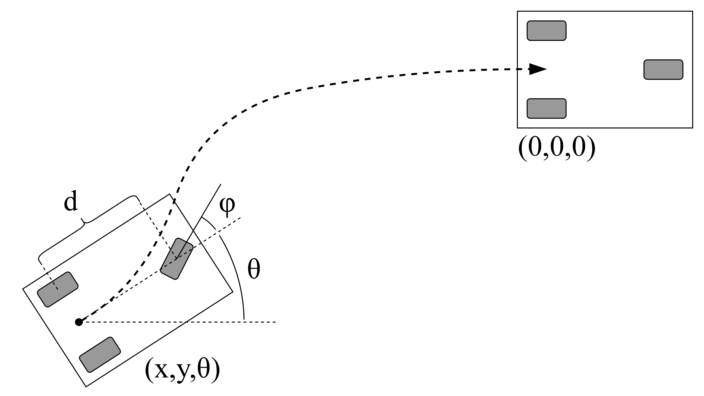

# Mobile Robot example

We consider a mobile robot parking problem in a 2D world.
Given an initial position $(x,y,\theta)$ the robot should park at position $(0,0,0)$,
which is illustrated in the figure below.



The robot has control inputs for the forward velocity $v$ and the steering angle $\phi$
and the wheeldistance $d$ as parameter.

We define the following tricycle kinematic model for this mobile robot:
$$
\begin{bmatrix}
\dot{x} \\
\dot{y} \\
\dot{\theta}
\end{bmatrix}=
\begin{bmatrix}
v \cos(\theta) \cos(\phi) \\
v \sin(\theta) \cos(\phi) \\
v \sin(\phi) / d
\end{bmatrix}
$$

## Model Implementation

The model can be implemented in the `MobileRobot` class that defines
the `State`, `Control` and `Parameters` types and the system dynamics function.
The dynamics function needs to be implemented in a templated fashion,
such that it works with Eigen's `AutoDiffScalar` type for calculating derivatives.

We also need to define the _Lagrange_ and _Mayer_ terms of the cost function.
The _Lagrange_ term defines a cost on the state and control vectors along the prediction horizon
and the _Mayer_ term defines the final cost on the state at the end of the trajectory.
Both terms are quadratic functions, where the matrix coefficients need to be carefully tuned to obtain satisfactory results.

The example implementation is shown in the `simple_robot_model.hpp` listing:
```Cpp
#ifndef SIMPLE_ROBOT_MODEL_HPP
#define SIMPLE_ROBOT_MODEL_HPP

#include "Eigen/Dense"

template <typename _Scalar = double>
struct MobileRobot
{
    MobileRobot(){}
    ~MobileRobot(){}

    using Scalar     = _Scalar;
    using State      = Eigen::Matrix<Scalar, 3, 1>;
    using Control    = Eigen::Matrix<Scalar, 2, 1>;
    using Parameters = Eigen::Matrix<Scalar, 1, 1>;

    /** the one for automatic differentiation */
    template<typename DerivedA, typename DerivedB, typename DerivedC, typename DerivedD>
    void operator() (const Eigen::MatrixBase<DerivedA> &state, const Eigen::MatrixBase<DerivedB> &control,
                     const Eigen::MatrixBase<DerivedC> &param, Eigen::MatrixBase<DerivedD> &value) const
    {
        value[0] = control[0] * cos(state[2]) * cos(control[1]);
        value[1] = control[0] * sin(state[2]) * cos(control[1]);
        value[2] = control[0] * sin(control[1]) / param[0];
    }
};

template<typename _Scalar = double>
struct Lagrange
{
    using Scalar = _Scalar;
    using State = Eigen::Matrix<Scalar, 3, 1>;
    using Control  = Eigen::Matrix<Scalar, 2, 1>;
    using Parameters = Eigen::Matrix<Scalar, 1, 1>;

    Eigen::Matrix<Scalar, State::RowsAtCompileTime, State::RowsAtCompileTime> Q;
    Eigen::Matrix<Scalar, Control::RowsAtCompileTime, Control::RowsAtCompileTime> R;

    Lagrange(){
        Q << 0.5, 0, 0,
             0, 0.5, 0,
             0, 0, 0.01;
        R << 1, 0,
             0, 0.001;
    }
    ~Lagrange(){}


    /** the one for automatic differentiation */
    template<typename DerivedA, typename DerivedB, typename DerivedC, typename CostT>
    void operator() (const Eigen::MatrixBase<DerivedA> &state, const Eigen::MatrixBase<DerivedB> &control,
                     const Eigen::MatrixBase<DerivedC> &param, CostT &value) const
    {
        value = state.dot(Q * state) + control.dot(R * control);
    }

};

template<typename _Scalar = double>
struct Mayer
{
    Mayer(){
        Q << 20, 0, 0,
             0, 20, 0,
             0, 0, 10;
    }
    ~Mayer(){}

    using Scalar = _Scalar;
    using State = Eigen::Matrix<Scalar, 3, 1>;
    using Control  = Eigen::Matrix<Scalar, 2, 1>;
    using Parameters = Eigen::Matrix<Scalar, 1, 1>;

    Eigen::Matrix<Scalar, State::RowsAtCompileTime, State::RowsAtCompileTime> Q;

    template<typename StateT, typename CostT>
    void operator() (const Eigen::MatrixBase<StateT> &state, CostT &value) const
    {
        using ScalarT = typename Eigen::MatrixBase<StateT>::Scalar;
        value = state.dot(Q.template cast<ScalarT>() * state);
    }
};

#endif // SIMPLE_ROBOT_MODEL_HPP
```

## Controller example

With the model dynamics and cost function defined,
we choose some approximation scheme (here Chebyshev polynomials of order 3)
and construct the NMPC controller.
One needs to choose an initial state, parameters and bounds on state and control vectors.

An code example shown in the `main.cpp` listing.
```Cpp
#include <iostream>
#include <limits>
#include "control/nmpc.hpp"
#include "control/simple_robot_model.hpp"
#include "polynomials/ebyshev.hpp"
#include "solvers/sqp.hpp"

using Problem = polympc::OCProblem<MobileRobot<double>, Lagrange<double>, Mayer<double>>;
using Approximation = Chebyshev<3, GAUSS_LOBATTO, double>;
using Controller = polympc::nmpc<Problem, Approximation, sqp::SQP>;

using State = Controller::State;
using Control = Controller::Control;
using Parameters = Controller::Parameters;

int main(int argc, char **argv)
{
    Controller robot_controller;

    State x = {-1, -0.5, -0.5};
    Control u;
    Parameters p(0.5);

    robot_controller.setStateBounds(
        {-10, -10, -std::numeric_limits<double>::infinity()},
        {10, 10, std::numeric_limits<double>::infinity()}
    );
    robot_controller.setControlBounds(
        {0, -1},
        {1, 1}
    );
    robot_controller.setParameters(p);
    robot_controller.disableWarmStart();

    std::cout << "x0 " << x.transpose() << std::endl;

    for (int i = 0; i < 30; i++) {

        robot_controller.computeControl(x);
        robot_controller.getOptimalControl(u);
        robot_controller.enableWarmStart();

        // crude integrator
        const double dt = 0.001;
        for (int j = 0; j < 200; j++) {
            State dx;
            robot_controller.m_ps_ode.m_f(x, u, p, dx);
            x = x + dt * dx;
        }

        std::cout << "x " << x.transpose() << "    " <<
                     "u " << u.transpose() << std::endl;

    }
}
```
