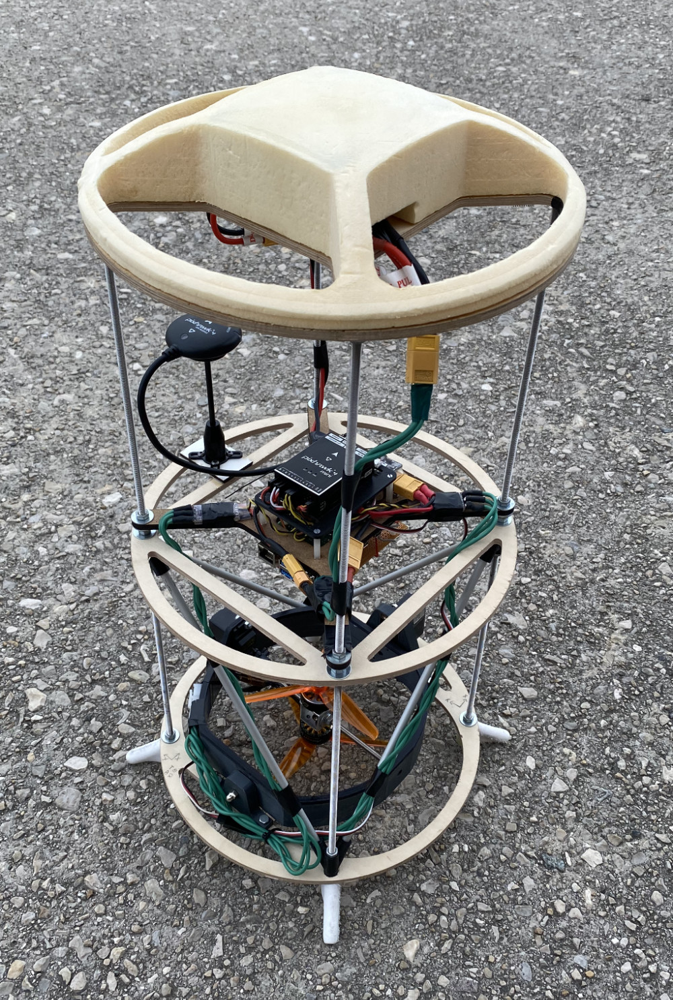
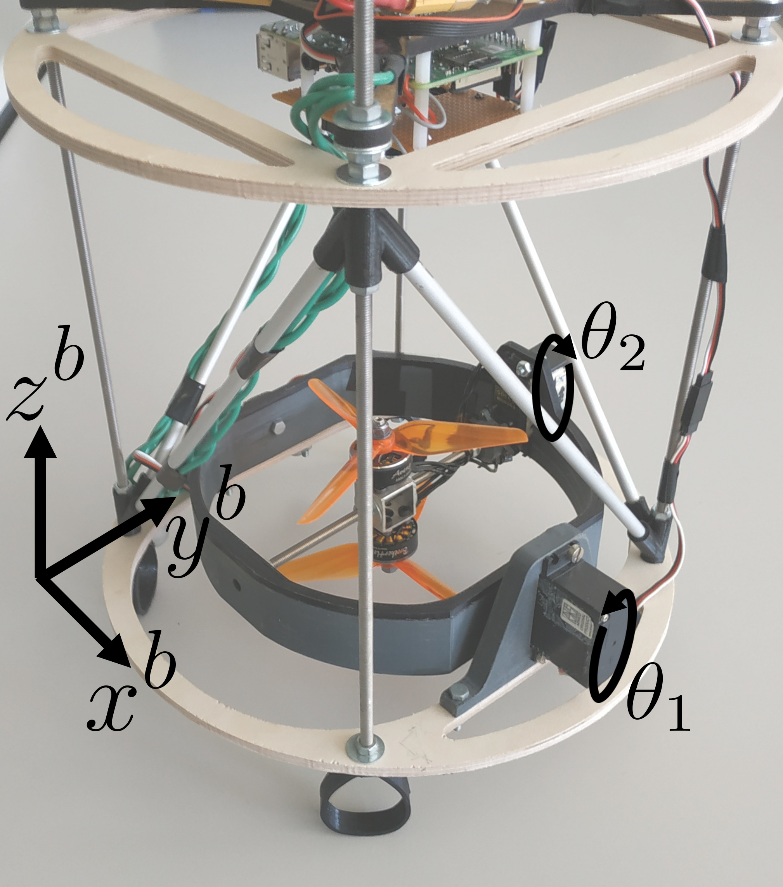
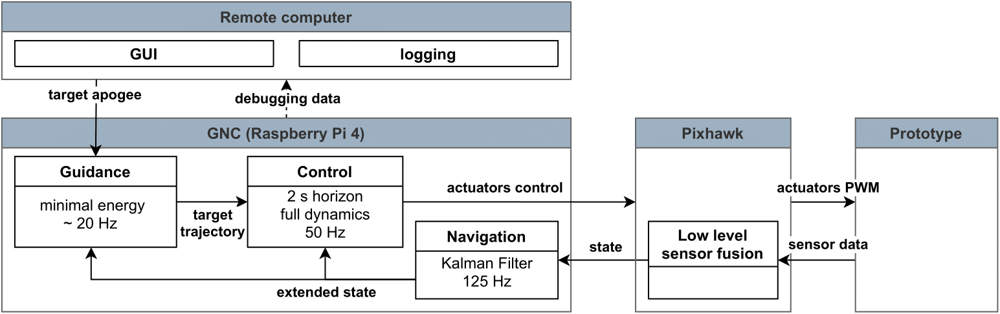
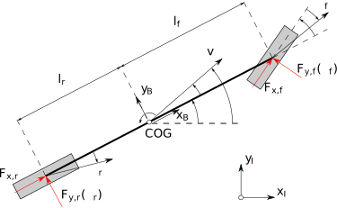
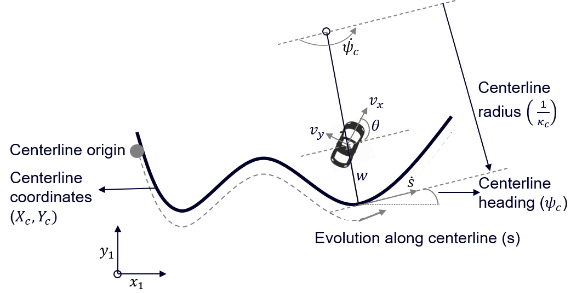

.. _chapter-app:

=========================
Examples and Applications
=========================

This chapter contains some examples and robotic applications using *PolyMPC*.

Thrust Vector Control of a Rocket
=================================

Thrust Vector Control (TVC) is a key technology enabling rockets to perform complex autonomous missions, such as active stabilization, orbit insertion, or propulsive landing.
This is achieved by independently controlling the thrust direction and magnitude of each of its engines. Compared to aerodynamic control such as fins or canard, it guarantees
a high control authority even in the absence of an atmosphere, i.e. during high altitude launches or exploration of other planetary bodies.

Below we demonstrate how the *PolyMPC* software is used to buid a guidance and nonlinear stabilisation systems for a small-scale rocket mock-up. The C++ code is shown to
run real-time on a low-cost ARM-based embedded platform.

.. image:: img/draw_mpc_simu_demo.gif
   :width: 400
   :align: center

System Dynamics
^^^^^^^^^^^^^^^

The state vector is denoted :math:`X`, and contains the position vector, the velocity, the orientation quaternion :math:`q`, and the angular speed in the body frame :math:`\omega^b`.

.. math::

    \begin{equation}
    \begin{split}
        X &=
        \begin{bmatrix}
        p& v& q& \omega^b
    \end{bmatrix}^T\\
    \end{split}
    \label{eq:state}
    \end{equation}

The control vector is denoted :math:`U`. The prototype is controlled through the command servo angles :math:`\theta_1` and :math:`\theta_2`, as well as the speed of the bottom
and top propellers, :math:`P_{B}` and :math:`P_{T}` respectively (in :math:`\%` for the rest of the paper). It is more convenient, however, to consider the propellers' average
command speed as an input :math:`\overline{P} = \frac{P_{B} + P_{T}}{2}` and the command speed difference :math:`P_{\triangle}=P_{B} - P_{T}`:

.. math::

    \begin{equation}
        U =
        \begin{bmatrix}
        \theta_1& \theta_2& \overline{P}& P_{\triangle}
        \end{bmatrix}^T
    \end{equation}

The state equations are given by the generic 6 DoF solid body dynamics. Omitting the atmosphere interaction, the forces acting on the vehicle are: gravity :math:`mg`, thrust
:math:`F^b_T` and total torque :math:`M^b` in BRF. :math:`M^b` comprises the torque due to the thrust vector :math:`F^b_T` and the torque :math:`M^b_P` caused by the speed
difference between the two propellers.

.. math::

    \begin{equation}
    \begin{split}
        &\dot{X}
        =
        f(X, U)
        =
        \begin{bmatrix}
        \dot{p}\\
        \dot{v}\\
        \dot{q}\\
        \dot{\omega^b}\\
        \end{bmatrix}
        =
        \begin{bmatrix}
        v\\
        \cfrac{R(q) F^b_T}{m} + g\\
        \frac{1}{2} q \circ \omega^b\\
        I^{-1} (M^b - \omega^b \times (I\omega^b))\\
        \end{bmatrix}\\
        &M^b = r \times F^b_T + M^b_P\\
    \end{split}
    \end{equation}

with :math:`I` the inertia matrix of the drone, and :math:`r` the position of the thrust :math:`F^b_T` from the center of mass, and :math:`R(q)` is a rotation matrix.

Both the thrust :math:`F^b_T` and the torque :math:`M^b_P` vectors are determined by the gimbal angles:

.. math::

    \begin{equation}
    \begin{split}
        \frac{F^b_T}{\lVert F^b_T \rVert}=\frac{M^b_P}{\lVert M^b_P \rVert }=
        \begin{bmatrix}
        \sin\theta_2\\
        -\sin\theta_1 \cos\theta_2\\
        \cos\theta_1 \cos\theta_2\\
    \end{bmatrix}
    \end{split}
    \end{equation}

*Rocket Model Implementation:* `drone_model.hpp <https://github.com/EPFLRocketTeam/tvc_drone/blob/main/drone_optimal_control/include/drone_optimal_control/drone_model.hpp>`_

Rocket Guidance Algorithm
^^^^^^^^^^^^^^^^^^^^^^^^^

The guidance algorithm is based on a point mass model and uses a minimal energy formulation where terminal time :math:`t_f` is an optimization variable. The final position
:math:`p(t_f)` is constrained to the small neighborhood of the target position :math:`p_t` with zero-velocity. The corresponding optimal control problem (OCP) is

.. math::

    \begin{equation}
    \begin{split}
        &\min_{F_T(t), \phi(t), \psi(t), t_f} \; \int_{t_0}^{t_f} F^2_T(t) dt + \rho \eta\\
        &\begin{split}
        s.t. \quad & \dot{p}(t) = v(t), \; \dot{v}(t) = \frac{F_T(t)}{m} \begin{bmatrix}
        \sin\phi \sin\psi \\
        -\cos\phi \sin\psi \\
        \cos\psi \\
        \end{bmatrix} + g\\
        & v_{min} \leq v(t) \leq v_{max}\\
        & F_{min} \leq F_T(t) \leq F_{max}\\
        - & \psi_{max} \leq \psi(t) \leq \psi_{max} \\
        & p(t_0) = p_0\\
        & v(t_0) = v_0\\
        & z(t_f) = z_{t}\\
        & (x(t_f)-x_{t})^2 + (y(t_f)-y_{t})^2 \leq \eta\\
        & v(t_f) =0\\
    \end{split}
    \end{split}
    \label{eq:OCP}
    \end{equation}

The propulsion vector of the rocket is defined in spherical coordinates, where :math:`F_T` is an absolute value of thrust, azimuth angle :math:`\phi` and polar angle
:math:`\psi`. Symmetric constraints on the polar angle define the aperture of the reachable cone. Since the attitude of the vehicle is not explicitly considered in the
guidance problem, the polar angle is usually related to the tilt angle of the rocket, thus should not be too large.

The slack variable :math:`\eta` weighted by :math:`\rho` is used to formulate a slack constraint on the target horizontal position, which may be violated when close to the
target position.

Since the guidance problem has free terminal time, the horizon is scaled to the interval [0, 1], :math:`\tau \equiv \frac{t-t_0}{t_f-t_0}`, the dynamics become
:math:`\dot{x} = (t_f-t_0) f(x, u)`, and the horizon length :math:`(t_f-t_0)` then becomes a variable parameter in the OCP.

.. math::

    \begin{equation}
    \begin{split}
    &\min_{u(t)} \; \int_{t_0}^{t_f} l(x, u, t) dt + V_f(x_f)\\
        &\begin{split}
        s.t. \quad & \dot{x} = f(x, u)\\
        & -\theta_{max} \leq \theta_1 \leq \theta_{max}\\
        & -\theta_{max} \leq \theta_2 \leq \theta_{max}\\
        & -\dot{\theta}_{max} \leq \dot{\theta_1} \leq \dot{\theta}_{max}\\
        & -\dot{\theta}_{max} \leq \dot{\theta_2} \leq \dot{\theta}_{max}\\
        & P_{min} \leq \bar{P} + {P_\delta}/2 \leq P_{max}\\
        & P_{min} \leq \bar{P} - {P_\delta}/2 \leq P_{max}\\
        & {P_\delta}_{min} \leq P_\delta \leq {P_\delta}_{max}\\
        & 0 \leq z\\
        \end{split}
    \end{split}
    \end{equation}

*Guidance Algorithm Implementation:*
`drone_guidance_ocp.hpp <https://github.com/EPFLRocketTeam/tvc_drone/blob/main/drone_optimal_control/include/drone_optimal_control/guidance/drone_guidance_ocp.hpp>`_ ,
`guidance_solver.hpp <https://github.com/EPFLRocketTeam/tvc_drone/blob/main/drone_optimal_control/include/drone_optimal_control/guidance/guidance_solver.hpp>`_

Model Predictive Tracking Control
^^^^^^^^^^^^^^^^^^^^^^^^^^^^^^^^^

The nonlinear model predictive control (NMPC) algorithm uses the full state dynamics described above. It has a predictionhorizon of 2 seconds.

.. math::

    \begin{equation}
    \begin{split}
    &\min_{U(t)} \; \int_{t_0}^{t_f} l(X, U, t) dt + V_f(X_f)\\
        &\begin{split}
        s.t. \quad & \dot{X} = f(X, U)\\
        & -\theta_{max} \leq \theta_1 \leq \theta_{max}\\
        & -\theta_{max} \leq \theta_2 \leq \theta_{max}\\
        & -\dot{\theta}_{max} \leq \dot{\theta_1} \leq \dot{\theta}_{max}\\
        & -\dot{\theta}_{max} \leq \dot{\theta_2} \leq \dot{\theta}_{max}\\
        & P_{min} \leq \overline{P} + P_{\triangle}/2 \leq P_{max}\\
        & P_{min} \leq \overline{P} - P_{\triangle}/2 \leq P_{max}\\
        & {P_{\triangle}}_{min} \leq P_{\triangle} \leq {P_{\triangle}}_{max}\\
        & 0 \leq z\\
        \end{split}
    \end{split}
    \label{eq:control_OCP}
    \end{equation}

The servo motors are constrained in a range of :math:`\pm 15^{\circ}`. We introduce derivative constraints to limit the maximum rate of inputs given by the controller
and smoothen the open-loop trajectories.

The propeller speed models are directly included in the formulation, and along with the constraints on top and bottom propeller speeds :math:`P_T` and :math:`P_B`, provide
a simple way to deal with the trade-off between roll control (through :math:`P_{\triangle}`) and altitude control (through :math:`\overline{P}`).

*Stage Cost*

The tracking residual at time :math:`t` corresponds to the difference between the predicted :math:`x(t)` and the target guidance trajectory :math:`x_G(t)`.
The stage cost combines the squared tracking residual, penalty on the control input and penalty on the deviation from vertical orientation.
The components :math:`q_w q_x-q_y q_z` and :math:`q_w q_y + q_x q_z` penalize deviations of pitch and yaw angles from zero. The roll angle is not controlled
directly, but rather the roll rate :math:`\omega^b_z`, as the final roll angle is not critical for the flight mission.

.. math::

    \begin{equation}
        l(X, U, t) = e(X - X_G (t))^T Q\; e(X - X_G (t)) + U^T R U
    \end{equation}

.. math::

    \begin{equation}
        e(X) \equiv \begin{bmatrix}p & v & q_w q_x-q_y q_z & q_w q_y + q_x q_z & \omega^b \end{bmatrix}^T
    \end{equation}

*Terminal Cost*

In order to improve stability, a continuous-time linear quadratic regulator (LQR) based on a linearization around the zero-speed steady-state
is used as a terminal controller. The matrices :math:`Q` and :math:`R` for the LQR design are identical to the ones used in the stage cost.

.. math::

    \begin{equation}
        A = \left.\frac{\partial f(x, u)}{\partial x}\right\vert_{x_s, u_s} \; B = \left.\frac{\partial f(x, u)}{\partial u}\right\vert_{x_s, u_s}
        \label{eq:linearised}
    \end{equation}

Note that the states :math:`q_w` and :math:`q_z` are fixed in the linearization, as they are not controlled. The matrix of the terminal quadratic cost :math:`Q_f` is
then obtained by solving the continuous time algebraic Riccati equation (CARE).

.. math::

    \begin{equation}
        V_f(X_f) = e(X_f)^T Q_f \; e(X_f)
    \end{equation}

*Predictive Controller Implementation:*
`drone_tracking_ocp.hpp <https://github.com/EPFLRocketTeam/tvc_drone/blob/main/drone_optimal_control/include/drone_optimal_control/control/drone_control_ocp.hpp>`_,
`drone_mpc.hpp <https://github.com/EPFLRocketTeam/tvc_drone/blob/main/drone_optimal_control/include/drone_optimal_control/control/drone_mpc.h>`_,
`drone_mpc_solver.hpp <https://github.com/EPFLRocketTeam/tvc_drone/blob/main/drone_optimal_control/include/drone_optimal_control/control/control_solver.hpp>`_

Experimental Flights and Presentation at ICRA 2023**
^^^^^^^^^^^^^^^^^^^^^^^^^^^^^^^^^^^^^^^^^^^^^^^^^^^^

The control system scheme is shown on the figure below.

.. raw:: html

    
<iframe width="560" height="315" src="https://www.youtube.com/embed/D8JUqUXYwB4" title="YouTube video player" frameborder="0" allow="accelerometer;
    autoplay; clipboard-write; encrypted-media; gyroscope; picture-in-picture; web-share" allowfullscreen></iframe>

References
^^^^^^^^^^

More details are available in [Linsen2022]_.

Race Car Path Following Control
===============================

Vehicle Dynamics
^^^^^^^^^^^^^^^^

The planar diagram of the bicycle model is shown below.

We first introduce the car dynamics in the natural Cartesian reference frame:

.. math::

    \begin{align}
        \dot{v_x} &= \dot{\psi} v_y + \frac{1}{M}(F_{x,f} \cos\delta  -F_{y,f} \sin\delta + F_{x,r} - F_{drag}), \nonumber\\
        \dot{v_y} &= \dot{\psi} v_x + \frac{1}{M}(F_{x,f} \sin\delta  + F_{y,f} \cos\delta + F_{y,r}), \\
        \dot{\omega} &= \frac{1}{I_z}( - L_r F_{y,r} + L_f (F_{y,f} cos\delta + F_{x,f} \sin\delta)), \nonumber\\
        \dot{X} &= v_x \cos\psi - v_y \sin\psi, \nonumber\\
        \dot{Y} &= v_x \sin\psi + v_y \cos\psi, \nonumber\\
        \dot{\psi} &= \omega, \nonumber
    \end{align}

The first three equations are the dynamics of the system in the car body frame with :math:`x` pointing forward along the main symmetry axis. The position and orientation
in the fixed Inertial reference frame (IRF) is given by :math:`X`, :math:`Y` and :math:`\phi`.

This bicycle model takes as input the steering angle :math:`\delta` and the front and rear axles longitudinal forces :math:`F_{xf}` and :math:`F_{xr}` as summarized below

.. math::

    \begin{equation}
        \begin{split}
            \dot{x} &= f(x,u) \\
            x &= [v_x, v_y, \omega, X, Y, \psi ],  \\
            u &= [\delta, F_{xf}, F_{xr}].
        \end{split}
    \end{equation}

There exist several approaches for tyre forces modelling which differ in numerical complexity. For autonomous driving at moderate speeds, one could use the linear
tyre model with a constant cornering stiffness. However, for high lateral accelerations in the racing scenarios the model becomes inadequate. It is important to
represent the lateral dynamics as accurately as possible, therefore, the Pacejka magic formula is used for tyre models:

.. math::

    \begin{equation}
        \begin{split}
        F_{yf} &= F_z D_f \sin\Big(C_f \tan{-1} \big(B_f \alpha_f - E_f (B_f \alpha_f - \tan^{-1}(B_f\alpha_f)) \big) \Big),  \\
        F_{yr} &= F_z D_r \sin\Big(C_r \tan^{-1}\big(B_r \alpha_r - E_r (B_r \alpha_r - \tan^{-1}(B_r\alpha_r)) \big) \Big).
        \end{split}
    \end{equation}

Front and rear lateral forces each have their own set of magic formula coefficients :math:`B, C, D, E` and are function of the slip angles :math:`\alpha`. The slip
angles can be modeled as

.. math::

    \begin{equation}
        \begin{split}
        \alpha_f &= -\tan^{-1}\Big(\frac{v_y + \dot{\psi}L_f}{v_x}\Big) + \delta,  \\
        \alpha_r &= -\tan^{-1}\Big(\frac{v_y - \dot{\psi}L_r}{v_x} \Big) .
        \end{split}
    \end{equation}

The navigation information is naturally provided in the Cartesian frame. For the control system, however, it is beneficial to represent the car position in the
reference frame linked to the track, the so called Curvilinear reference frame. This frame is also local and attached to the car body frame. This transformation
allows natural formulation of the path-following problem. Each point on a path characterised by a position in the Cartesian frame :math:`X_c, Y_c`, global heading
:math:`\psi_c` and a curvature :math:`\kappa_c`.

From the position and heading in the Cartesian frame, we calculate the distance :math:`w` and the heading deviation :math:`\theta` from the center line,
with :math:`w > 0` to the left of the center line and :math:`\theta > 0` a counter-clockwise rotation with respect to the tangent to the centerline :math:`\psi_c`.

.. math::

    \begin{align}
        \begin{split}
        w &= (Y-Y_c)\cos(\psi_c) - (X-X_c)\sin(\psi_c),\\
        X &= X_c - w\sin(\psi_c),  \\
        Y &= Y_c + w\cos(\psi_c),\\
        \theta &= \psi - \psi_c.
        \end{split}
    \end{align}

An additional state, :math:`s`, is added to track the evolution along the racing line. The resulting kinematic equations in the Curvilinear frame are:

.. math::

    \begin{equation}
        \begin{split}
        \dot{s} &= \frac{1}{1-\kappa_c w}(v_x \cos\theta -v_y sin\theta), \\
        \dot{w} &= v_x \sin\theta + v_y \cos\theta, \\
        \dot{\theta} &= \dot{\psi} - \dot{\psi_c} = \dot{\psi} - \kappa_c \dot{s}.\\
        \end{split}
    \end{equation}

From the position and heading in the Cartesian frame, we calculate the distance :math:`w` and the heading deviation :math:`\theta` from the center line, with
:math:`w > 0` to the left of the center line and :math:`\theta > 0` a counter-clockwise rotation with respect to the tangent to the centerline :math:`\psi_c`.

.. math:

    \begin{align}
        \begin{split}
        w &= (Y-Y_c)\cos(\psi_c) - (X-X_c)\sin(\psi_c),\\
        X &= X_c - w\sin(\psi_c),  \\
        Y &= Y_c + w\cos(\psi_c),\\
        \theta &= \psi - \psi_c.
        \end{split}
    \end{align}

.. literalinclude:: img/car_model.cpp
    :language: cpp

Path Parametrisation
^^^^^^^^^^^^^^^^^^^^

Oftentimes in practical applications, the path is represented by a set of equally spaced points, where each point is characterised by its position,
curvature and reference speed. However, such discrete representation is not very efficient for the path following NMPC or local replanning as it adds
constraints on the time discretisation, and requires an extra step to find the best point on the path to track. Therefore, in this example we
choose to interpolate the path with custom cubic splines that can be efficiently automatically differentiated. In the following, we detail the interpolation
procedure. Let :math:`y` denote one of the path parameters to be approximated by a cubic spline. We divide every data chunk into :math:`N_s` equidistant segments and fit
a cubic spline :math:`y(s)` parametrised by polynomial coefficients for each segment :math:`\{ P_i \}`.

.. math::

    \begin{equation}
        \begin{split}
        %y(s) = \sum_{i=0}^{3}P_{i, N_i}\times &s^i, \nonumber \qquad i \in [0, 1, 2, 3], N_i \in [1, \dots, N_s] \\
        \min_{\{ P_i \}} \sum_{s=0}^{s_{max}} (y(s) &- \tilde{y}(s))^2, \nonumber \\
        \textrm{subject to: } y(s=0) &= \tilde{y}(0), \nonumber\\
        \frac{dy}{ds}\bigg\rvert_{s=0} &= \dot{\tilde{y}}(0),
        \nonumber \\
        \frac{dy}{ds}\bigg\rvert_{s=s_{max}} &= \dot{\tilde{y}}(s_{max}),
        \nonumber \\
        \end{split}
    \end{equation}

Where :math:`s_{max}` is the maximum spline length and :math:`\tilde{y}(s)` is data evaluated at the grid points. The derivative constraints enforce continuity of the two
neighbouring segments.

We formulate a quadratic problem (QP) in the form of :math:`\frac{1}{2}(D^TP - \tilde{Y})^2` where P is the coefficient vector of all segments in one spline, and D is the
data vector containing all the grid points.

.. math::

    \begin{equation*}
    {D_i =
        \begin{bmatrix}
        1 & \dots & 1 \\
        s_{0,N_i} & \dots & s_{max,N_i} \\
        s_{0,N_i}^2 & \dots & s_{max,N_i}^2 \\
        s_{0,N_i}^3 & \dots & s_{max,N_i}^3
        \end{bmatrix}
        \in\mathbb{R}^{4\times N_{c,i}}}  \\
    \end{equation*}

.. math::

    \begin{equation}
        {D =
        \begin{bmatrix}
            D_1    &        &  \\
               & \ddots &  \\
               &        & D_{N_s}
        \end{bmatrix}}
    \end{equation}

where :math:`N_{c,i}` is the number of points in one segment of the chunk such that :math:`\sum_{i=1}^{N_s}N_{c,i} = N_c`, with :math:`N_c` the total number
of points; :math:`\tilde{Y} \in\mathbb{R}^{N_c \times 1}` is the vector of true data and :math:`P \in\mathbb{R}^{4\times 1}` is the coefficients vector to optimize over.

This least squares formulation has the same minimum as the equivalent QP problem:

.. math::
    \begin{equation}
    \begin{split}
        \min_{X} \frac{1}{2}X^T H X + h^T X,  \\
        \textrm{subject to: } AX = b.         \\
    \end{split}
    \end{equation}

where H, h, A are the Hessian, gradient and constraint Jacobian of the problem and b is the constant vector of data input.

.. math::

    \begin{equation}
    \begin{split}
        &A = \begin{bmatrix}
            A_1 & & \\
            & \ddots & \\
            & & A_{N_s} \\
        \end{bmatrix} \\
        &A_{N_i} = \begin{bmatrix}
            1 & s_{0,N_i} & s_{0,N_i}^2 & s_{0,N_i}^3 \\
            0 & 1 & 2s_{0,N_i} &3s_{0,N_i}^2 \\
            0 & 1 & 2s_{max,N_i} &3s_{max,N_i}^2 \\
            \end{bmatrix} \\
        &H = DD^T \nonumber, \\
        &h = -D \tilde{Y} \\
        &b  = [\tilde{y}_1(0),\dot{\tilde{y}}_0(0), \dot{\tilde{y}}_1(s_{max,1}), \cdots \\ &\dots,\tilde{y}_{N_s}(0),\dot{\tilde{y}}_{N_s}(0), \dot{\tilde{y}}_{N_s}(s_{max,N_s})]^T
    \end{split}
    \end{equation}

We approximate with splines the center line (:math:`X_c`, :math:`Y_c`), desired heading (tangent) (:math:`\psi_c`) and curvature (:math:`\kappa_c`).
A cubic spline is also fitted for the reference velocity profile (:math:`v_{x,ref}`). The QP problem is written and solved in the *PolyMPC* toolbox using the *ADMM QP* solver
at a microsecond scale even on embedded platforms.

Frame Transformation and Path Localisation
^^^^^^^^^^^^^^^^^^^^^^^^^^^^^^^^^^^^^^^^^^

Car navigation is typically represented in the Cartesian frame. Therefore, in order to estimate the car state in the Curvilinear frame using the equations from the section
"Vehicle Dynamics", one should first find the projection of the car onto the racing line.

This projection problem can be written as a minimization problem of the form:

.. math::

    \begin{equation}
    \begin{split}
        %&\min_{s}(X-X_c(s))^2 + (Y-Y_c(s))^2\\
        &\min_{s} \Vert p - p_c(s) \Vert^2 \\
        &\textrm{subject to}: 0 \leq s \leq s_{max}
    \end{split}
    \end{equation}

Where :math:`p = [x, y]^T` is the current positon of the car and :math:`p_c(s) = [x_c(s), y_c(s)]` is a parametric path, i.e., the cubic splines as defined
in the previous section.

Once an optimal solution :math:`s^{\star}` is found, :math:`\kappa_c` and :math:`v_{x,ref}` can be computed and the state vector is converted
to the Curvilinear frame. This NLP is solved using the *PolyMPC* toolbox using the dense SQP solver as shown below (example).

.. literalinclude:: img/frames.cpp
    :language: cpp

Path Following NMPC
^^^^^^^^^^^^^^^^^^^

For more comfortable driving, hard rate constraints on the steering and acceleration rates can be added. For this, one can
augment the system states with the steering control, delayed steering and the two longitudinal forces such that:

.. math::

    \begin{equation}
    \begin{split}
        &\frac{d}{dt}\delta = \dot{\delta} = v_1\\
        &\frac{d}{dt}\delta_d = \frac{\delta(t) - \delta_{d}(t)}{T_{d}}\\
        &\frac{d}{dt}F_{x,f} = \dot{F}_{x,f} = v_2 \\
        &\frac{d}{dt}F_{x,r} = \dot{F}_{x,r} = v_3 \\
    \end{split}
    \end{equation}

The resulting augmented state vector is denoted with :math:`\xi` and control with :math:`v`.

.. math::

    \begin{equation}
    \begin{split}
        \xi &= [v_x, v_y, \omega, s, w, \theta, \delta, \delta_{d}, F_{x,f}, F_{x,r}],  \\
        v &= [\dot{\delta}, \dot{F}_{x,f}, \dot{F}_{x,r}]  \\
        \dot{\xi} &=  F(\xi, v) = F\big(f(\eta, \{\delta_{d},F_{x,f}, F_{x,r} \}), v\big),  \\
    \end{split}
    \end{equation}

The constraints on the deviation from the center line :math:`w` define the right and left boundaries of the lane.
The slip angles are constrained to avoid tyre saturation. Finally, one may have:

.. math::
    \begin{equation}
        \begin{split}
                \min_{\xi(.),v(.)} \int_{t_0}^{t_f}  l(\xi(t),v(t), p) dt +  V_{f}(\xi(t_f)&)\\
                \textrm{subject to: }  \xi_{0} = \xi(0) \qquad& \\
                \dot{\xi}(t) =  F(\xi(t), v(t), p) \qquad &{t} \in [t_0, ..., t_f] \\%\textrm{ (Non-linear spatial frame dynamics)}\\
                0 \leq \frac{w(t) - w_r(t)}{w_l(t) - w_r(t)} \leq 1 \qquad & \\%\textrm{ (Road boundary constraint)} \\
                \theta_{min} \leq \theta({t_i}) \leq \theta_{max } \qquad & \\%\textrm{ (Heading deviation constraint)}\\
                v_{x,min} \leq v_x(t) \leq v_{x,max} \qquad & \\%\textrm{ (Longitudinal velocity constraint)} \\
                v_{y,min} \leq v_y(t) \leq v_{y,max} \qquad & \\%\textrm{ (Lateral velocity constraint)} \\
                \dot{\psi}_{min} \leq \dot{\psi}(t) \leq \dot{\psi}_{max} \qquad  &\\% \textrm{ (Yaw rate constraint)} \\
                0 \leq s(t)  \qquad \qquad &\\% \textrm{ (Evolution along centerline constraint)} \\
                \alpha_{min}\leq \alpha (t) \leq \alpha_{max} \qquad & \\%\textrm{ (Slip angles constraint)}\\
                \delta_{min} \leq \delta(t), \delta_d(t) \leq \delta_{max} \qquad &\\% \textrm{ (Steering angle constraint)}\\
                 F_{x,min} \leq F_{x,f}(t), F_{x,r}(t) \leq F_{x,max} \qquad &\\% \textrm{ (Longitudinal force constraint)}\\
                 \dot{\delta}_{min} \leq \dot{\delta(t)} \leq \dot{\delta}_{max} \qquad &\\% \textrm{ (Steering rate constraint)}\\
                 \operatorname{jerk_{x,min}} \leq \dot{F}_{x,f}(t), \dot{F}_{x,r}(t) \leq \operatorname{jerk_{x,max}} \qquad &\\% \textrm{ (Longitudinal force constraint)}\\
                \xi_N \in \chi_f. \qquad & \\
        \end{split}
    \end{equation}

We do not enforce equal front and rear longitudinal forces, but other control allocation strategies can be added at a later stage. Nevertheless, large differences
are penalised in the cost function. The stage cost :math:`l(x,u)` is defined as:

.. math::

    \begin{align}
        l(\xi(t),v(t), p) = (\xi^*(t) - \xi^*_{ref}(t)) ^ T Q (\xi^*(t) - \xi^*_{ref}(t))\\
        \;\;\; +\; v(t) ^ T R v(t) +  \sigma (F_{x,r} - F_{x,f})^2, \nonumber
    \end{align}

with :math:`Q \in\mathbb{R}^{10\times 10} \succeq 0, R \in\mathbb{R}^{3\times 3} \succ 0`, :math:`\sigma \in\mathbb{R} \geq 0`

The tracking is equivalent to keeping :math:`w` and :math:`\theta` close to zero. The coarse planner provides a velocity profile which helps to keep the optimisation horizon
shorter. Another benefit of the track-centered formulation is the position constraint which can be simplified to the variable box constraints. This makes tracking
the local racing line within a given corridor simpler. Below is a sketch of how such problem formulation can be implemented in *PolyMPC*

.. literalinclude:: img/car_ocp.cpp
    :language: cpp

Experiments
^^^^^^^^^^^

A few videos below demonstrate numerical simulation and embedded deployment of the path following controller. The first video shows an *RViz* visualition of the algorithm
with a nominal racing car model. Dark green is an ego-car, light-green is the predicted trajectory with a prediction horizon length of 2 seconds. We also highlight
a portion of the track accessible for the car vision system.

.. raw:: html

    
<iframe width="560" height="315" src="https://www.youtube.com/embed/gaHsBm58RvU" title="YouTube video player" frameborder="0" allow="accelerometer;
    autoplay; clipboard-write; encrypted-media; gyroscope; picture-in-picture; web-share" allowfullscreen></iframe>

In the second setup, the algorithm runs along with the other navigation software in the processor-in-the-loop (PiL) simulation on a Speedgoat machine with a real-time
operating system (QNX 7.1). This time, the predictive controller drives a high-fidelity racing car model available in the Roborace simulator.

.. raw:: html

    
<iframe width="560" height="315" src="https://www.youtube.com/embed/zp0nDcAcn08" title="YouTube video player" frameborder="0" allow="accelerometer;
    autoplay; clipboard-write; encrypted-media; gyroscope; picture-in-picture; web-share" allowfullscreen></iframe>

The third video demonstrates the algorithm deployment on an embedded *Nvidia Xavier* platform. A small *F1tenth* prototype autonomously performs a double line change
manoeuvre using stereo-cameras for navigation. Some timings for these experiments can found in the *Benchmark* subsection below.

.. raw:: html

    
<iframe width="560" height="315" src="https://www.youtube.com/embed/YJP9KpYGPuY" title="YouTube video player" frameborder="0" allow="accelerometer;
    autoplay; clipboard-write; encrypted-media; gyroscope; picture-in-picture; web-share" allowfullscreen></iframe>

**Benchmarks**

+------------------------+------------+--------------+---------------+
| Platform               |     PC     | Speedgoat    | Nvidia Xavier |
+========================+============+==============+===============+
| System                 |   Windows  |    QNX 7.1   |     Linux     |
+------------------------+------------+--------------+---------------+
| Compiler               | Visual C++ |     qcc      |      gcc      |
+------------------------+------------+--------------+---------------+
| OCP [ms]               | 6.21 / 7.9 | 10.7 / 11.37 | 15.43 / 18.21 |
+------------------------+------------+--------------+---------------+
| Spline fitting [ms]    | 0.02 /0.03 | 0.03 / 0.037 | 0.053 / 0.061 |
+------------------------+------------+--------------+---------------+
| Frame Transform [ms]   | 0.012/0.16 | 0.02 / 0.023 | 0.044 / 0.051 |
+------------------------+------------+--------------+---------------+

